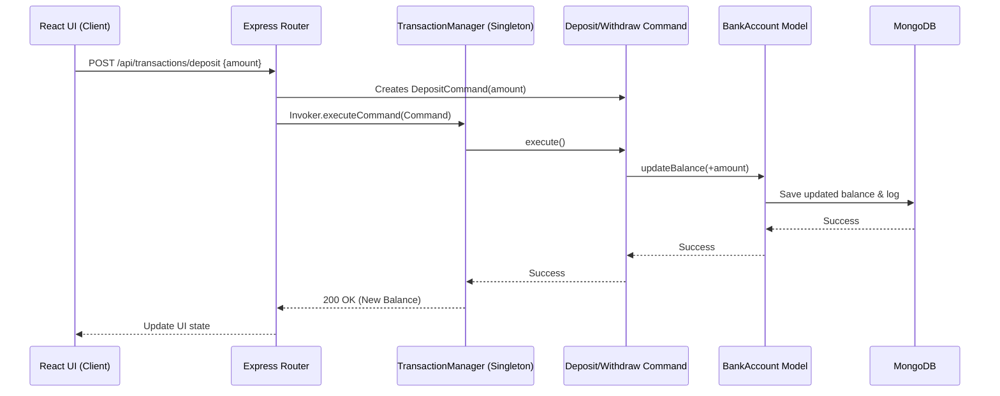

# 🏦 Banking Transaction System (MERN Stack Architecture)

## 📌 Title
Banking Transaction System Using Command and Singleton Patterns with MERN Stack Integration

---

## 🎯 Project Objective
Develop a professional, robust banking system adapted for the **MERN Stack** (MongoDB, Express, React, Node.js) while strictly adhering to academic software architecture principles. The system performs deposit and withdrawal operations, maintains a reliable transaction history, and strictly implements the **Command Pattern** and **Singleton Pattern** within a clean **3-Tier Architecture**.

---

## 🏗 Architecture (3-Tier MERN Adaptation)

This system maintains strict separation of concerns through a standard 3-tier web architecture:

### 1. Presentation Layer (React.js)
* **Responsibility:** Handles user interaction and UI rendering.
* **Components:** Lightweight React components for capturing user inputs (Amounts) and triggering operations (Deposit/Withdraw buttons).
* **Rule:** Contains *zero* business logic; strictly communicates with the backend via REST API.

### 2. Business Logic Layer (Node.js & Express.js - CORE)
* **Responsibility:** Houses all system rules and design patterns.
* **Patterns Used:**
  * **Command Pattern:** Encapsulates transaction requests as objects.
  * **Singleton Pattern:** Manages central transaction processing.
* **Components:** Controllers, Services, Command implementations, and the `TransactionManager`.

### 3. Data Layer (MongoDB & Mongoose)
* **Responsibility:** Data persistence and schema validation.
* **Components:** Mongoose Models (`BankAccount`, `Transaction`) and DAO (Data Access Object) classes.
* **Rule:** Completely isolated from the UI. Accessed only by the Business Logic Layer.

---

## 🧩 Core Design Patterns

### 🔹 Command Pattern (Behavioral Pattern)
Instead of executing banking operations directly, requests are encapsulated as command objects.
* **Command Interface:** Defines a standard `execute()` method.
* **Concrete Commands:** `DepositCommand` and `WithdrawCommand`.
* **Benefits:** 
  * Achieves loose coupling between the API controller and the bank account logic.
  * Allows us to easily store a history of executed commands for the transaction log.
  * Makes it easy to implement future features like "Undo" if necessary.

### 🔹 Singleton Pattern (Creational Pattern)
Ensures that the core banking processing engine has only one active instance across the entire Node.js server lifecycle.
* **Implementation:** `TransactionManager` (or `BankSystem`) class.
* **Benefits:** Prevents race conditions, centralizes the command execution pipeline, and ensures the transaction history array remains consistent in memory while being synchronized to the database.

---

## 🔁 System Flow



---

## 🗂 Proposed Directory Structure

```text
/Bank-Transaction
│
├── /frontend               # Presentation Layer (React)
│   ├── /src
│   │   ├── /components     # UI Components
│   │   ├── /services       # API Callers
│   │   └── App.js
│
└── /backend                # Business & Data Layers (Node/Express)
    ├── /src
    │   ├── /commands       # Command Pattern implementations
    │   │   ├── Command.js
    │   │   ├── DepositCommand.js
    │   │   └── WithdrawCommand.js
    │   │
    │   ├── /core           # Singleton implementations
    │   │   └── TransactionManager.js
    │   │
    │   ├── /models         # Data Layer (Mongoose)
    │   │   ├── BankAccount.js
    │   │   └── TransactionHistory.js
    │   │
    │   ├── /routes         # API Endpoints
    │   └── server.js       # Express App Entry
    │
    ├── package.json
    └── .env
```

---

## 🗣 Presentation Summary (Pitch)

> *"This project demonstrates a rigorous application of software architecture principles within a modern web framework. By adapting the system to the MERN stack, we utilize React for a clean Presentation Layer, while strictly enforcing the Command and Singleton design patterns in our Node.js Business Logic Layer. MongoDB acts as our Data Layer, fully abstracted through DAOs. This ensures a highly cohesive, loosely coupled system capable of reliably processing and logging financial transactions."*
