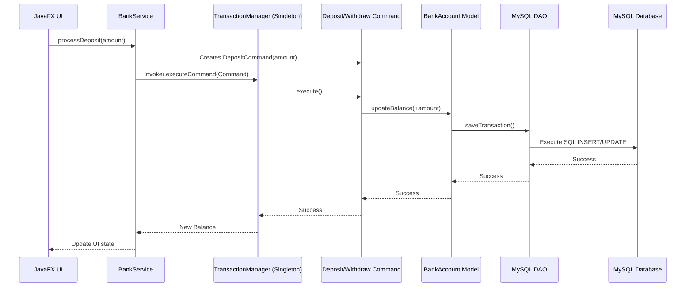

# 🏦 Banking Transaction System (Java & MySQL Architecture)

## 📌 Title
Banking Transaction System Using Command and Singleton Patterns with Java and MySQL Integration

---

## 🎯 Project Objective
Develop a professional, robust banking system adapted for **Java and MySQL** while strictly adhering to academic software architecture principles. The system performs deposit and withdrawal operations, maintains a reliable transaction history, and strictly implements the **Command Pattern** and **Singleton Pattern** within a clean **3-Tier Architecture**.

---

## 🏗 Architecture (3-Tier Java Adaptation)

This system maintains strict separation of concerns through a standard 3-tier desktop architecture:

### 1. Presentation Layer (JavaFX)
* **Responsibility:** Handles user interaction and UI rendering.
* **Components:** Lightweight JavaFX controllers and FXML views for capturing user inputs (Amounts) and triggering operations (Deposit/Withdraw buttons).
* **Rule:** Contains *zero* business logic; strictly communicates with the backend services.

### 2. Business Logic Layer (Java Core)
* **Responsibility:** Houses all system rules and design patterns.
* **Patterns Used:**
  * **Command Pattern:** Encapsulates transaction requests as objects.
  * **Singleton Pattern:** Manages central transaction processing.
* **Components:** Services, Command implementations, and the `TransactionManager`.

### 3. Data Layer (MySQL & JDBC)
* **Responsibility:** Data persistence and schema validation.
* **Components:** DAO (Data Access Object) classes and Entity Models (`BankAccount`, `Transaction`).
* **Rule:** Completely isolated from the UI. Accessed only by the Business Logic Layer.

---

## 🧩 Core Design Patterns

### 🔹 Command Pattern (Behavioral Pattern)
Instead of executing banking operations directly, requests are encapsulated as command objects.
* **Command Interface:** Defines a standard `execute()` method.
* **Concrete Commands:** `DepositCommand` and `WithdrawCommand`.
* **Benefits:** 
  * Achieves loose coupling between the UI controller and the bank account logic.
  * Allows us to easily store a history of executed commands for the transaction log.
  * Makes it easy to implement future features like "Undo" if necessary.

### 🔹 Singleton Pattern (Creational Pattern)
Ensures that the core banking processing engine has only one active instance across the entire application lifecycle.
* **Implementation:** `TransactionManager` (or `BankSystem`) class.
* **Benefits:** Prevents race conditions, centralizes the command execution pipeline, and ensures the transaction history array remains consistent in memory while being synchronized to the database.

---

## 🔁 System Flow



---

## 🗂 Proposed Directory Structure

```text
/Bank-Transaction
│
├── /src
│   ├── /presentation           # Presentation Layer (JavaFX)
│   │   ├── /controllers        # UI Controllers
│   │   ├── /views              # FXML Files
│   │   └── MainApp.java        # Entry Point
│   │
│   ├── /business               # Business Logic Layer
│   │   ├── /commands           # Command Pattern implementations
│   │   │   ├── Command.java
│   │   │   ├── DepositCommand.java
│   │   │   └── WithdrawCommand.java
│   │   │
│   │   ├── /core               # Singleton implementations
│   │   │   └── TransactionManager.java
│   │   │
│   │   └── /services           # Service Interfaces
│   │
│   ├── /data                   # Data Layer
│   │   ├── /dao                # Data Access Objects (JDBC)
│   │   ├── /models             # Entity Classes (BankAccount, Transaction)
│   │   └── DatabaseConfig.java # MySQL Connection Details
│   │
│   └── /resources
│       └── db_schema.sql       # MySQL Database Setup Script
│
├── pom.xml                     # Maven Configuration (or build.gradle)
└── README.md
```

---

## 🗣 Presentation Summary (Pitch)

> *"This project demonstrates a rigorous application of software architecture principles. By adapting the system to Java and MySQL, we utilize JavaFX for a clean Presentation Layer, while strictly enforcing the Command and Singleton design patterns in our Business Logic Layer. MySQL acts as our Data Layer, fully abstracted through DAOs via JDBC. This ensures a highly cohesive, loosely coupled system capable of reliably processing and logging financial transactions."*
