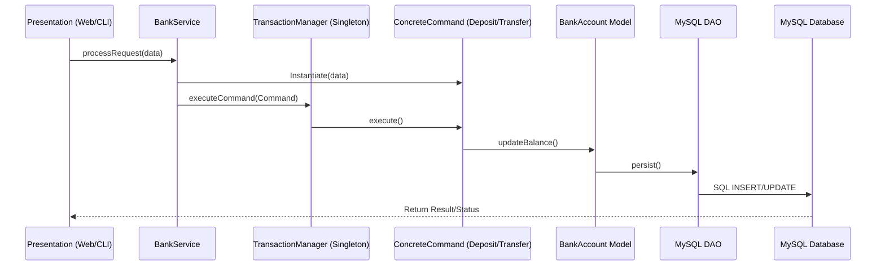

# 🏦 Banking Transaction System
> **Software Architecture & Design (SAD) Project**

[](https://www.oracle.com/java/)
[](https://www.mysql.com/)
[](#-architecture-3-tier-java-adaptation)
[](#-core-design-patterns)

---

## 📌 Project Overview
This project is a professional, robust banking system developed with a strict focus on **Software Architecture Principles**. It handles complex financial operations like deposits, withdrawals, and inter-account transfers while maintaining a reliable audit trail in a MySQL database.

The system is built using a **3-Tier Architecture** and implements the **Command** and **Singleton** design patterns to ensure scalability, thread safety, and loose coupling.

---

## 🏗 Architecture (3-Tier Implementation)
The system maintains a strict separation of concerns to ensure that modifications in one layer do not break others.

### 1️⃣ Presentation Layer (Multi-Client Interface)
*   **Web Interface:** Modern HTML5/JavaScript frontend for Customers and Admins.
*   **CLI Interface:** Admin and Client command-line tools for direct system interaction.
*   **Responsibility:** Captures user inputs and displays transaction results. It contains **zero** business logic.

### 2️⃣ Business Logic Layer (The Core)
*   **Services:** `BankService.java` acts as the primary API for the presentation layer.
*   **Design Patterns:**
    *   **Command Pattern:** Every transaction (Deposit, Withdraw, Transfer) is an object.
    *   **Singleton Pattern:** `TransactionManager` ensures central, thread-safe execution.
*   **Responsibility:** Enforces banking rules, calculates fees, and manages the execution pipeline.

### 3️⃣ Data Access Layer (Persistence)
*   **Technologies:** MySQL & JDBC.
*   **Components:** DAO classes (`BankAccountDAO`, `TransactionDAO`, `AdminDAO`).
*   **Responsibility:** Handles all database communications, ensuring data integrity and persistence.

---

## 🧩 Core Design Patterns

### 🔹 Command Pattern (Behavioral)
Banking operations are encapsulated as objects, allowing for request parameterization and history logging.
*   **Concrete Commands:** `DepositCommand`, `WithdrawCommand`, `TransferCommand`.
*   **Benefits:** 
    *   **Loose Coupling:** The UI doesn't need to know how a transfer works internally.
    *   **Audit Trail:** Every command is saved to the `command_history` table for a 100% accurate log.
    *   **Reversibility:** Simplifies the implementation of "Undo" operations.

### 🔹 Singleton Pattern (Creational)
Ensures the core execution engine (`TransactionManager`) has exactly one instance.
*   **Benefits:** 
    *   **Thread Safety:** Centralizes all balance updates to prevent race conditions.
    *   **Consistency:** Guarantees that the transaction history remains synchronized across the entire app.

---

## 🔁 System Flow



---

## 🗂 Project Structure (Actual)
```text
/Bank-Transaction
├── frontend/                   # Web-based Presentation Layer
│   ├── pages/                  # Admin & Customer HTML pages
│   ├── css/                    # Modern styling
│   └── js/                     # Frontend logic & API calls
├── src/main/java/com/bank/
│   ├── business/               # Business Logic Layer
│   │   ├── commands/           # Command Pattern: Deposit, Withdraw, Transfer
│   │   ├── core/               # Singleton: TransactionManager
│   │   └── services/           # Service API: BankService
│   ├── data/                   # Data Access Layer
│   │   ├── dao/                # DAOs: Admin, BankAccount, Transaction
│   │   ├── models/             # Entities: BankAccount, Transaction
│   │   └── DatabaseConfig.java # JDBC Connection Management
│   └── presentation/           # Presentation Layer (Back-end)
│       ├── controllers/        # WebController (Jetty Bridge)
│       └── CLI/                # AdminCLI, ClientCLI
└── pom.xml                     # Maven Dependencies
```

---

## 🗣 Presentation Pitch
> *"This project demonstrates a rigorous application of software architecture. By utilizing a 3-Tier model, we isolate user interaction from data persistence. The Command Pattern allows us to treat financial actions as trackable objects, while the Singleton Pattern ensures our transaction engine is safe and centralized. This is not just a banking app; it is a demonstration of maintainable and scalable software design."*

---

## 🚀 Development Roadmap
- [x] **Phase 1:** Core Models & Database Schema setup.
- [x] **Phase 2:** JDBC & DAO Implementation for MySQL.
- [x] **Phase 3:** Command & Singleton Pattern integration.
- [x] **Phase 4:** Web Controller & Frontend Development.
- [x] **Phase 5:** Multi-role (Admin/Customer) support and Fee logic.
- [ ] **Phase 6:** Advanced Security & Unit Testing.

---
*Created for the SAD Project Presentation - 2026*
